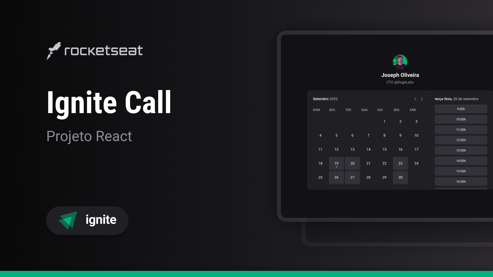

# Ignite Call


Esta aplicação foi desenvolvida a partir do módulo do treinamento de ReactJS da Rocketseat, no qual foi utilizado os componentes do design system desenvolvido no módulo anterior, porém decidi refatorar todo projeto com as features mais recentes do Next.JS 14 com App Router, ou seja, 
uma arquitetura totalmente diferente, mais atual e adequada para projetos next.js para os dias atuais. O objetivo a aplicação é criar um sistema de agendamentos interligando com API Agenda do Google, ao final o sistema cria um evento no Google Agenda, onde alguns dos aprendizados foram utilizar o google api e o Auth.js para autenticação de usuários.No desenvolvimento do design system utilizei o [Auth.js](https://authjs.dev/), biblioteca para autenticação de usuários, [prisma](https://www.prisma.io/), um dos ORM mais utilizados em projetos React, [React Hook Form](https://react-hook-form.com/) para manipulação de formulários, [ZOD](https://zod.dev/) para validação de tipo de dados, [dayjs](https://day.js.org/) para manipulação e formatação de datas e horas, [React Query](https://tanstack.com/query/latest) para gerenciamento de estado, [Google API](https://www.npmjs.com/package/googleapis) para acessar os serviços do google, [Lucide](https://lucide.dev/) para ícones, [tailwind-variants](https://www.tailwind-variants.org/), para criação de componentes utilizando estilização com [TailwindCSS](https://tailwindcss.com/), [tailwind-merge](https://github.com/dcastil/tailwind-merge), biblioteca que a auxilia na criação de componentes e para finalizar [Storybook](https://storybook.js.org/) para documentar todo design system.
Algo que venho utilizando bastante é a biblioteca da rocketseat [eslint-config-rocketseat](https://github.com/Rocketseat/eslint-config-rocketseat) como uma boa configuração ESlint e formatação com Prettier.

## Tecnologias Utilizadas


## Fluxo da aplicação

1. Inserir um username.
2. Com o campo username preenchido, inserir o nome.
3. confirmar login social pelo Google.
4. Selecionar os dias e horários que está disponível.
5. Selecionar data de horário do agendamento.
6. Confirmar agendamento
7. Ao final irá ser criando um evento no google com o agendamento

## Inicializar a aplicação:

Caso tenha interesse em clonar o repositório favor seguir as seguites instruções:

Criar um arquivo .env com seguintes variáveis de ambientes:
```javascript

DATABASE_URL
DATABASE_DIRECT_URL
BASE_URL
NEXT_PUBLIC_BASE_URL

AUTH_GOOGLE_ID
AUTH_GOOGLE_SECRET

AUTH_SECRET
AUTH_URL
```

Para inicializar a aplicação utilizar os comandos
```javascript
npm install
npm run dev

	or

yarn install
yarn dev
```

## A aplicação está hospedada na Vercel
[https://07-ignite-call-three.vercel.app/](https://07-ignite-call-three.vercel.app/)